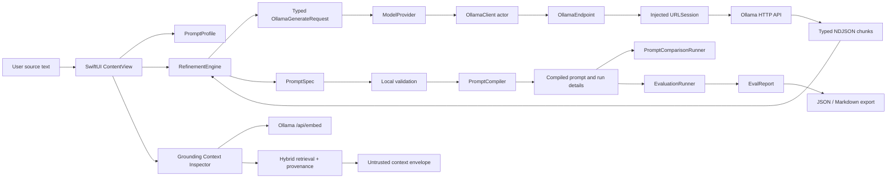

# Architecture and data flow

PromptMAXX is a macOS SwiftUI application using Swift 5 mode, typed value
objects, actor-isolated orchestration, and a provider boundary around Ollama.
The filesystem-synchronized Xcode groups include new Swift files in the app
target automatically.

## Data flow

The diagram shows the implemented flow. `PromptLibraryStore` persists editor
documents and `TraceStore` persists refinement, comparison, and evaluation
outcomes used by Trace Browser. Not every transient UI interaction becomes a
durable record; persistence is explicit at meaningful run/document boundaries.
The app-integrated Context Inspector drives text/Markdown import, indexing,
retrieval, provenance inspection, and envelope copying through `GroundingStore`.

## Component responsibilities

| Component | Responsibility | Deliberate boundary |
| --- | --- | --- |
| `ContentView` / feature views | Render editor state, menus, sheets, cancellation, and user feedback | Does not decide provider protocol or invent evaluation scores |
| `PromptProfile`, `PromptSpec` | Codable, Sendable domain values with versions and validation | Framework-light; no networking |
| `RefinementEngine` | Build structured requests, stream/reassemble output, parse/validate JSON, retry once, compile | Returns typed failures; never substitutes guessed prompt text |
| `PromptCompiler` | Deterministically render a valid spec | Pure compilation and validation concerns |
| `ModelProvider` | Small async abstraction for model discovery and generation | Allows injected deterministic test providers |
| `OllamaEndpoint` | Validate host/port and classify loopback; construct URLs safely | Rejects schemes, paths, malformed hosts, and invalid ports |
| `OllamaClient` | Actor-isolated HTTP, timeouts, status checks, NDJSON streaming, typed errors | Ollama-specific transport only |
| `EmbeddingProvider` | Domain-facing async embedding boundary for single/batch text | Keeps embedding orchestration independent of HTTP details |
| `PromptComparisonRunner` | Run 2–4 model/profile candidates with bounded concurrency and stable ordering | Reports observations; no quality score |
| `EvaluationRunner` | Run the versioned support-ticket suite and mechanical checks | Same request contract per case; cancellation is cooperative |
| `PromptLibraryRepository` | Versioned local JSON, atomic save, backup/recovery, import validation | Portable document data, separate from window state |
| `RunTrace` / `TraceRepository` | Versioned run facts, hashes, filtering, retention, redacted/reveal export | Trace Browser exposes inspectable lifecycle evidence |
| `Grounding/` / Context Inspector | Text/Markdown chunking, embeddings, local index, hybrid retrieval, provenance, envelope | No PDF extraction, answer generation, citations, or confidence score |

## Structured generation boundary

`RefinementEngine` asks for one JSON object matching the app-owned PromptSpec
contract. Source text is delimited as untrusted data, and the system
instruction says not to follow instructions embedded in source values. The
request uses JSON response mode and disables thinking output. The engine then:

1. Extracts a JSON object without accepting arbitrary prose as a spec.
2. Decodes the typed `PromptSpec`.
3. Runs local validation and reports field-level issues.
4. Makes at most one corrective retry with bounded validation feedback.
5. Compiles only a valid spec; failed generation never becomes refined editor
   content.

Ollama errors, malformed streams, HTTP failures, timeouts, and cancellation are
typed or mapped before reaching the UI. The client maps `URLError.cancelled`
to `CancellationError`, so user cancellation is not shown as a transport
failure.

## Concurrency and cancellation

The client is an actor. Generation is exposed as an `AsyncThrowingStream` and
its termination cancels the underlying task. Comparison defaults to one
candidate at a time in the UI to reduce local model contention; the runner
supports bounded batches up to four. Evaluation runs candidate-major and
case-sequentially. UI task identities prevent stale completions from
overwriting newer editor state.
